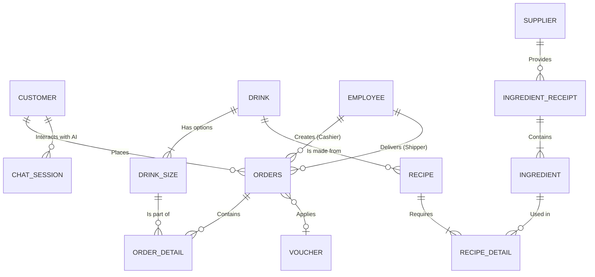

# 🏗️ Kiến Trúc Hệ Thống & Tài Liệu Kỹ Thuật (Phê La ERP)

Tài liệu này đóng vai trò là "Kim chỉ nam" (Single Source of Truth) cho toàn bộ đội ngũ phát triển, mô tả cấu trúc kiến trúc tổng thể, sơ đồ dữ liệu, chiến lược triển khai và các quy chuẩn tích hợp bảo mật của hệ thống Phê La.

---

## 🎯 1. Tổng Quan & Hướng Dẫn Đọc

Tài liệu được phân cấp theo từng nhóm đối tượng độc giả:

- **System Architect / Tech Lead:** Đọc mục 2 & 3 để hiểu luồng dữ liệu và thiết kế Database.
- **Backend / Frontend Developer:** Đọc mục 4 để nắm quy chuẩn tích hợp API bên thứ 3 an toàn.
- **DevOps / SysAdmin:** Đọc mục 5 & 6 để hiểu chiến lược Deploy và CI/CD.
- **Fresher / Newcomer:** Đọc mục 7 để biết cách setup môi trường trên máy cá nhân.

Hệ thống được thiết kế theo kiến trúc **Monorepo** với 3 module độc lập chạy song song:

1. `apps/api`: Backend Core (Express.js + Prisma).
2. `apps/web`: Admin Portal & POS System (Next.js).
3. `apps/customer`: E-commerce Customer App (Next.js).

---

## 🏛️ 2. Sơ Đồ Kiến Trúc Hệ Thống (System Architecture)

Dự án áp dụng mô hình Client-Server hiện đại, tách biệt hoàn toàn Frontend và Backend, giao tiếp qua RESTful API, Realtime Socket và tích hợp mạnh mẽ với các đối tác thứ ba (Thanh toán, Vận chuyển, Trí tuệ nhân tạo).

```mermaid
graph TD
    subgraph Client [Client Tier (Frontend)]
        C[Customer Web App<br>Next.js 14]
        A[Admin POS Portal<br>Next.js 14]
    end

    subgraph Core [Logic Tier (Backend)]
        API[API Gateway & Server<br>Node.js + Express]
        Socket[Realtime Engine<br>Socket.io]
        Job[Background Workers<br>Node-cron]

        API --- Socket
        API --- Job
    end

    subgraph Data [Data Tier]
        DB[(Primary Database<br>SQL Server)]
    end

    subgraph External [Third-party Services]
        PayOS[PayOS<br>VietQR Payment]
        GHN[Giao Hàng Nhanh<br>Logistics]
        Gemini[Google Gemini<br>AI LLM]
        Firebase[Firebase Cloud Messaging<br>Push Notifications]
    end

    %% Connections
    C <-->|REST API + Socket| API
    A <-->|REST API + Socket| API

    API <-->|Prisma ORM| DB

    API -->|Create Payment Link| PayOS
    PayOS -->|Webhook Notification| API

    API <-->|Calculate Fee / Push Order| GHN
    API <-->|Prompt & Tool Calling| Gemini
    API -->|Trigger Alert| Firebase
    Firebase -.->|Push| C
```

---

## 🗄️ 3. Mô Hình Thực Thể & Cơ Sở Dữ Liệu (ERD)

Database sử dụng **SQL Server**, được quản lý hoàn toàn bằng **Prisma ORM**. Dưới đây là lược đồ ERD (Entity-Relationship Diagram) thu gọn thể hiện các bảng cốt lõi nhất của dự án (Lượt bỏ các bảng phụ để dễ hình dung):



> **Lưu ý Kiến trúc DB:** Hệ thống sử dụng Cắt tỉa (Soft-delete) đối với một số dữ liệu quan trọng để đảm bảo tính toàn vẹn của lịch sử hóa đơn. Lịch sử nhập kho (Receipt) và trừ nguyên liệu (Recipe/Disposal) được liên kết chặt chẽ để phục vụ thuật toán HUI-Miner (Tính lợi nhuận).

---

## 🧠 4. Core Business Logic & Algorithms

Hệ thống triển khai một số luồng nghiệp vụ cốt lõi sau để đảm bảo quy trình vận hành chuỗi F&B tự động hóa hoàn toàn:

### 4.1. Hệ Thống Chấm Công Thông Minh (24h Window Shift Logs)
- **Vấn đề:** Nhân viên pha chế thường xuyên làm các ca kéo dài qua đêm (Ví dụ: từ 22h hôm trước đến 06h sáng hôm sau). Nếu dùng hàm `Date()` thuần túy, thao tác Check-out vào ngày hôm sau sẽ bị tách thành một bản ghi chấm công mới độc lập, gây sai lệch bảng lương.
- **Giải pháp (24h Window Logic):** Thuật toán Check-out sẽ quét lùi thời gian (look-back) trong vòng 24 giờ. Nếu phát hiện một bản ghi Check-in có trạng thái "Đang làm việc" của chính nhân viên đó, hệ thống sẽ tự động ghép nối thời gian Check-out hiện tại vào bản ghi Check-in của ngày hôm qua. Đảm bảo dữ liệu ca làm xuyên đêm được tính toán thời lượng làm việc (Duration) chính xác tuyệt đối.

### 4.2. Khôi Phục & Đền Bù Voucher (Compensation System)
- **Vấn đề:** Khách hàng áp dụng mã giảm giá giới hạn (Voucher) để đặt hàng. Tuy nhiên, nếu cửa hàng hết nguyên liệu và Admin buộc phải "Từ chối/Hủy" đơn hàng đó, khách sẽ bị mất oan mã giảm giá.
- **Giải pháp (Voucher Refund & Compensation Engine):**
  - Khi Admin thao tác Hủy đơn (Trạng thái `CANCELLED`), hệ thống Backend tự động kiểm tra xem đơn hàng có dùng Voucher không.
  - Nếu có, Backend lập tức giảm biến đếm `UsedCount` của Voucher đó để hoàn trả lượt sử dụng.
  - Nếu Voucher đó đã hết hạn (`ValidUntil` < Now), Backend tự động sinh ra một mã Voucher đền bù (Compensation Voucher) mới với cùng tỷ lệ giảm giá, thời hạn mới, và cấp phát trực tiếp vào Ví Voucher (CustomerVoucher) của khách hàng đó, đồng thời bắn Push Notification thông báo xin lỗi & đền bù qua Firebase.

### 4.3. Marketing Tự Động: Abandoned Carts & Referral Rewards
- **Giỏ Hàng Bỏ Quên (Abandoned Carts):** Mọi phiên thêm sản phẩm vào giỏ hàng chưa thanh toán đều được lưu lại và hiển thị trên Dashboard Quản trị. Quản lý có thể lọc các giỏ hàng bỏ quên này để gửi SMS SMS hoặc Voucher kích cầu mua sắm.
- **Tặng Thưởng Giới Thiệu (Referral Rewards):** Bất cứ khi nào một khách hàng mới hoàn tất đơn hàng thành công đầu tiên, hệ thống sẽ kích hoạt Hook tạo tự động các mã giảm giá đặc biệt (Referral Vouchers) dành tặng cho khách hàng đó nhằm mục đích giữ chân (Retention).

---

## 🔐 5. Tiêu Chuẩn Tích Hợp Bảo Mật Dành Cho Developer

Không giống như các dự án học thuật, khi đưa lên Production, các đoạn code tích hợp cần phải có cơ chế bảo vệ nghiêm ngặt. Dưới đây là các tiêu chuẩn bắt buộc:

### 5.1. Bảo mật Webhook PayOS (Chống gian lận nạp tiền)

Không bao giờ tin tưởng mù quáng vào data đẩy về từ Webhook. Kẻ gian có thể giả mạo request POST vào `/webhook` để báo thành công.

- **Quy tắc:** Bắt buộc sử dụng hàm `verifyPaymentWebhookData` của thư viện `@payos/node`. Hàm này sẽ dùng `CHECKSUM_KEY` sinh ra chữ ký HMAC để đối chiếu. Nếu chữ ký không khớp, lập tức Reject request.
- **Webhook Configuration:** Thay vì sử dụng ngrok để test local, hệ thống đã được public, do đó chỉ cần cấu hình trực tiếp Public Webhook URL trỏ về API Backend trên Render.

### 5.2. Quản trị Bộ nhớ AI Chatbot (Gemini)

LLM (Large Language Model) thường xuyên bị quên ngữ cảnh nếu đoạn chat quá dài (vượt quá Context Window) hoặc sinh lỗi trả về text thay vì JSON.

- **Quy tắc Function Calling:** Khi AI gọi Tool (ví dụ: `check_order_status`), luôn bọc trong `try-catch` và quy định rõ `Schema` (Zod) cho dữ liệu AI sinh ra.
- **Bảo mật:** Không tiêm (Inject) toàn bộ thông tin Database vào System Instruction. Chỉ tiêm danh sách Menu hiện hành. Mọi dữ liệu nhạy cảm (Doanh thu, Lịch sử khách khác) BẮT BUỘC phải dùng Function Calling để kiểm soát quyền (Authorization).

### 5.3. Xác thực Realtime (Socket.io Auth)

- **Rủi ro:** Client bất kỳ có thể mở F12, tự kết nối Socket vào server và nghe lén dữ liệu đơn hàng (`NEW_ORDER`).
- **Quy tắc:** Socket Connection phải mang theo JWT Token. Backend sử dụng Middleware của Socket.io để decode Token. Nếu không phải nhân viên hợp lệ, lập tức ngắt kết nối (`socket.disconnect()`).

---

## 🚀 6. Chiến Lược Triển Khai (Deployment & DevOps)

Để hệ thống chịu tải tốt và dễ dàng mở rộng (Scale), đề xuất mô hình triển khai như sau:

### 6.1. Cơ sở dữ liệu (Database Layer)

- Sử dụng **SQL Server** được triển khai trên máy chủ quản lý dữ liệu riêng.
- Thiết lập tự động Backup hàng ngày.

### 6.2. Backend API Server (Node.js)

- Triển khai Backend Web Services trực tiếp lên nền tảng **Render** (render.com).
- Môi trường Production phải thiết lập `NODE_ENV=production` trên Render để bỏ qua các log thừa và tăng hiệu suất Express.

### 6.3. Frontend Web & Customer App

- Triển khai trực tiếp lên **Vercel** bằng Github Integration.
- Vercel tự động hỗ trợ Next.js Caching và CDN, giúp hình ảnh đồ uống tải siêu tốc.

---

## 🧪 7. Chiến Lược Kiểm Thử (Testing & CI/CD)

Để tránh tình trạng "sửa lỗi chỗ này, vỡ chức năng chỗ kia", mọi Pull Request (PR) đều phải thỏa mãn:

1. **TypeScript Checker:** Github Actions sẽ chạy `npm run build` hoặc `tsc --noEmit`. Nếu code sai kiểu dữ liệu, PR sẽ bị Block.
2. **Unit Test (Jest):** Các module liên quan đến tính tiền (Voucher, Shipping Fee, Tổng đơn) bắt buộc phải có Unit Test (`npm run test`).
3. **Lint & Prettier:** Sử dụng Husky để bắt lỗi Format code trước khi cho phép `git commit`.

---

## 💻 8. Hướng Dẫn Setup Môi Trường Local (Onboarding)

Dành cho thành viên mới gia nhập team:

1. Đảm bảo máy có Node.js >= v18, Git, và công cụ quản lý DB (như SQL Server Management Studio hoặc DBeaver).
2. Clone dự án và cài thư viện tổng:
   ```bash
   git clone https://github.com/Kolaid08/TeaShopPheLa.git
   cd TeaShopPheLa
   npm install
   ```
3. Lấy file biến môi trường (`.env`) từ Tech Lead, bỏ vào thư mục `apps/api`.
4. Khởi tạo Database và Seed dữ liệu mẫu:
   ```bash
   cd apps/api
   npx prisma generate
   npx prisma db push
   npx prisma db seed
   ```
5. Khởi động toàn bộ Monorepo:
   ```bash
   cd ../..
   npm run dev
   ```
6. Truy cập:
   - POS/Admin: `http://localhost:3000` (Mã PIN: `4444` / `2222`)
   - API Server: `http://localhost:3001`
   - Customer App: `http://localhost:3002` (SĐT mẫu: `0987654321`)

---

## 🛠️ 9. Hướng Dẫn Tích Hợp Dịch Vụ Bên Thứ 3 (Dành Cho Người Mới)

Dưới đây là hướng dẫn "cầm tay chỉ việc" để bạn có thể tự thiết lập các dịch vụ (PayOS, Giao Hàng Nhanh, Gemini AI) từ con số 0 và đưa vào dự án.

### 9.1. Tích hợp Cổng Thanh Toán PayOS (Chuyển khoản QR Code)

PayOS giúp hệ thống tự động nhận biết khách đã chuyển khoản thành công.

- **Bước 1: Tạo tài khoản.** Truy cập [payos.vn](https://payos.vn) và đăng ký tài khoản doanh nghiệp hoặc cá nhân.
- **Bước 2: Tạo Kênh Thanh Toán.** Sau khi đăng nhập, chọn "Tạo kênh thanh toán mới". Điền thông tin cửa hàng Phê La.
- **Bước 3: Lấy API Keys.** Vào mục **Cài đặt -> API Keys**. Bạn sẽ thấy 3 mã quan trọng. Hãy copy và dán vào file `.env` của `apps/api`:
  - `PAYOS_CLIENT_ID="..."`
  - `PAYOS_API_KEY="..."`
  - `PAYOS_CHECKSUM_KEY="..."`
- **Bước 4: Cấu hình Webhook (Rất quan trọng).** Chuyển sang tab Webhook. Nhập URL Server Backend đã được deploy trên Render của bạn (ví dụ: `https://api.phela.com/api/v1/payment/payos/webhook`). Do dự án đã được Public trên Render, chúng ta không cần dùng ngrok. Bấm "Xác nhận Webhook".

### 9.2. Tích hợp Giao Hàng Nhanh (GHN) - Tính phí Ship

- **Bước 1:** Đăng ký tài khoản tại [khachhang.ghn.vn](https://khachhang.ghn.vn).
- **Bước 2:** Vào mục **Cửa hàng (Shop)**, điền địa chỉ kho hàng của bạn (ví dụ: Quận 1, TP.HCM). Hệ thống sẽ cấp cho bạn một `SHOP_ID`.
- **Bước 3:** Vào mục **Quản lý API Token**, tạo mới một Token.
- **Bước 4:** Cập nhật file `.env` ở `apps/api`:
  - `GHN_TOKEN="Mã_Token_Vừa_Tạo"`
  - `GHN_SHOP_ID="ID_Cửa_Hàng_Của_Bạn"`
- **Lưu ý:** API của GHN có môi trường Test và Production khác nhau. Hãy dùng URL Test (https://dev-online-gateway.ghn.vn) trong lúc dev.

### 9.3. Tích hợp Google Gemini AI (Phê La AI Chatbot)

- **Bước 1:** Truy cập [Google AI Studio](https://aistudio.google.com).
- **Bước 2:** Đăng nhập bằng tài khoản Google, chọn **Get API Key** ở menu bên trái.
- **Bước 3:** Bấm nút **Create API Key in new project**. Copy đoạn mã đó.
- **Bước 4:** Dán vào file `.env` của thư mục `apps/api`:
  - `GEMINI_API_KEY="AIzaSyB..."`
- **Sử dụng trong Code:** Đảm bảo thư viện `@google/generative-ai` đã được cài (`npm install @google/generative-ai`). Thư viện này đã được cấu hình sẵn trong `apps/api/src/modules/chat/ai.service.ts`, nó sẽ tự động lấy key từ `.env` để chat và gọi hàm (Function Calling).
